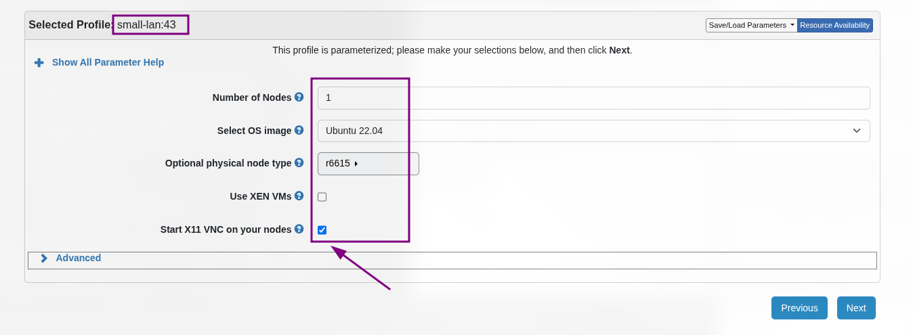
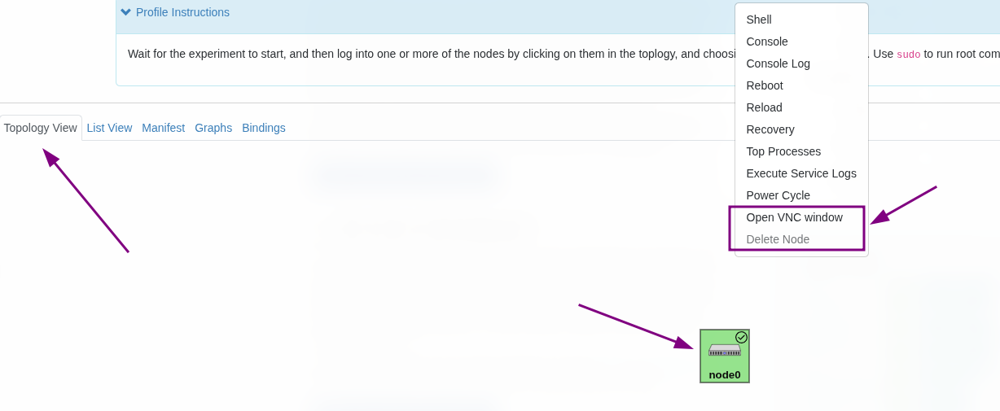
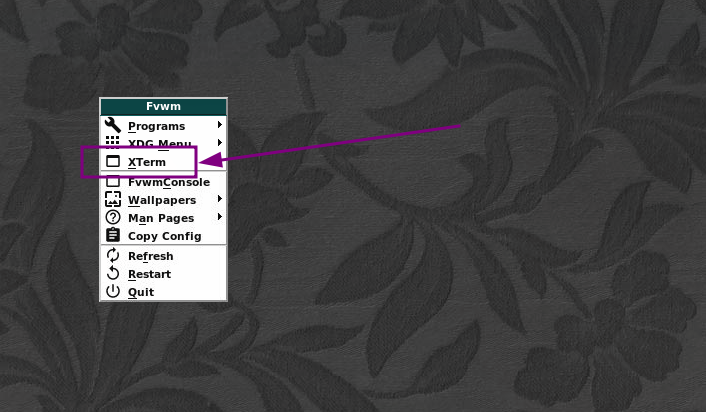
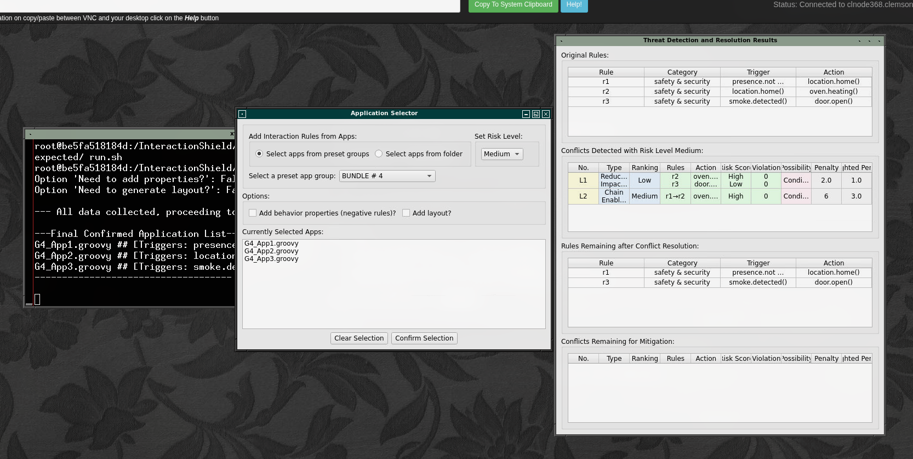

# **InteractionShield: Harnessing Event Relations for Interaction Threat Detection and Resolution in Smart Homes**

## Description

This artifact contains source code for Section 5 of our paper.

- Infrastructure: [CloudLab](https://www.cloudlab.us/)
- Expected storage: < 2 GB
- Expected runtime:
    - Claim 1: a few minutes (via GUI)
    - Claim 2: > 20 hours
        - Scaled-down Claim 2: ~40 minutes
    - Claim 3: ~15 minutes
        - Scaled-down Claim 3: ~5 minutes
    - Claim 4: ~10 hours
        - Scaled-down Claim 4: ~30 minutes
- Repository: https://github.com/InteractionShield/InteractionShield
- Datasets:
    - Large-scale real-world dataset
        - The large-scale real-world datasets required for Claims 1, 3, and 4 have already been automatically downloaded during the Docker build process.
        - Specifically, the Dockerfile at `infrastructure/Dockerfile` places the archive at `/opt/InteractionShield.tar.gz`.
        - When you execute any of the provided `run.sh` scripts, this dataset is automatically extracted into the following directories:
            - `/InteractionShield/artifact/InteractionShield/Datasets`
            - `/InteractionShield/artifact/InteractionShield/Examples`
            - `/InteractionShield/artifact/InteractionShield/Files`
    - Randomly Generated SmartApps Dataset
        - For Claim 2, the required random app dataset is generated during the experiment runs and will be stored under:
            - `/InteractionShield/artifact/Intermediate/apps`
- To reproduce Claims:
    - Claim 1:
        - run install.sh
        - then claims/claim1/run.sh
        - Expected output is in claims/claim1/expected/
    - Claim 2:
        - run install.sh
        - then claims/claim2/run.sh
        - [optional] scaled-down version: claims/claim2/run_fast.sh
        - Expected output is in claims/claim2/expected/
    - Claim 3:
        - run install.sh
        - then claims/claim3/run.sh
        - [optional] scaled-down version: claims/claim3/run_fast.sh
        - Expected output is in claims/claim3/expected/
    - Claim 4:
        - run install.sh
        - then claims/claim4/run.sh
        - [optional] scaled-down version: claims/claim4/run_fast.sh
        - Expected output is in claims/claim4/expected/

## Set Up the Environment on [CloudLab](https://www.cloudlab.us/)

### Choose Profile Parameters

Select `small-lan` profile with `Ubuntu 22.04`, node type `r6615`, and enable `Start X11 VNC` on the node.

Profile link: [CloudLab small-lan (pre-filled params)](https://www.cloudlab.us/p/PortalProfiles/small-lan&rerun_paramset=e0a72296-9b4a-11f0-bc80-e4434b2381fc)



### Start X11 VNC

Click on `Topology View`, select the node, and choose `Open VNC window`. This will open the VNC interface.



### Start XTerm Terminal

`Left-click` on the desktop background and select `XTerm` terminal. Once the terminal window opens in VNC, you can begin running the experiments there.



### Prepare for the Experiments

In the XTerm Terminal, install the required packages (`git`, `xhost`, and `docker`). Next, clone the repository to the host machine, navigate to the `InteractionShield` project directory, and run the installation script. After completing these steps, the experimental setup will be ready.

Note: Running Docker requires `sudo`

```bash
sudo apt update
sudo apt install git x11-xserver-utils docker.io
git clone https://github.com/InteractionShield/InteractionShield.git
cd InteractionShield/
sudo chmod +x install.sh
sudo ./install.sh
```

**IMPORTANT: ALL** steps below are to be executed within the running Docker container `interaction_shield` and inside the `InteractionShield` folder. If you successfully enter the container, the prompt should look like this (note that 69c9825a16d9 will be different for everyone, as it's the container ID):

```bash
root@15556b52b000:/InteractionShield#
```

### Make the shell script and gradlew executable

```bash
chmod +x /InteractionShield/claims/claim1/run*.sh
chmod +x /InteractionShield/claims/claim2/run*.sh
chmod +x /InteractionShield/claims/claim3/run*.sh
chmod +x /InteractionShield/claims/claim4/run*.sh

chmod +x /InteractionShield/artifact/Intermediate/tools/*.sh

chmod +x /InteractionShield/artifact/IoTCOM/FormalAnalyzer/gradlew
```

### Example of a GUI Running in VNC

The figure below shows an example of a GUI application running inside the VNC environment:


## Artifact Evaluation

All experiments were executed in Docker under the path `/InteractionShield`

### Claim 1: Accuracy Validation && Case Study && GUI

**Note:** Before using the GUI in Docker, make sure `xhost` is installed and execute `xhost +` to allow X11 access from Docker containers.

This experiment correspond to Section 5.2 (Table 16, Table 17), Figure 5 in the Appendix and Section 5.5 (Table 8, Table 9). The detailed results are provided in Appendix Tables 16 and 17. Table 16 reports results for Bundles #1–#8 in the GUI, while Table 17 reports results for HOMEGUARD #1–#11. Because HOMEGUARD #9 in Table 17 has two different inputs, we split it into HOMEGUARD #9 and #11.

In Tables 16 and 17, all possible conflicts are listed. Conflicts shown in bold are detected exclusively by our approach. Conflicts that are underlined were detected by both prior work and our approach but are not considered conflicts under the current risk level. Conflicts in italics are detected only by our approach but are likewise not considered conflicts under the current risk level.

The default risk level is set to **Medium**. To display all possible conflicts, the risk level should be changed to **Low**.

```bash
cd claims/claim1/
./run.sh
```

### Claim 2: Comparison of different tools

This experiment compares IoTCom, IoTSan, and InteractionShield, correspond to Section 5.3 (Figure 2). Because IoTSan and IoTCom are relatively slow, running `run.sh` takes more than 20 hours. To address this, we provide a scaled-down version, `run_fast.sh`, for quicker experimentation.

**Note:** IoTCom requires a very large amount of memory. If running the full version results in an Out of Memory error, please edit line 11 of `claims/claim2/run.sh` and change the value from 50 to a number lower than 20. You may still encounter the error “Cannot allocate memory; There is insufficient memory for the Java Runtime Environment to continue.” In that case, you will need to run the experiment on a machine with more memory.

full version:

```bash
cd claims/claim2/
./run.sh
```

scaled-down version:

```bash
cd claims/claim2/
./run_fast.sh
```

### Claim 3: Statistics of Conflicts && Estimation of lambda

This experiment calculates the average number of conflicts and derives the value of lambda, corresponding to Section 5.3 (Figure 3) and Section 5.4 (Figure 4).

full version:

```bash
cd claims/claim3/
./run.sh
```

scaled-down version:

```bash
cd claims/claim3/
./run_fast.sh
```

### Claim 4: Performance Evaluation

This experiment evaluates the performance overhead, corresponding to Section 5.6 (Figure 10). The original setup was run 1,000 times and required approximately 10 hours. For convenience, we provide a scaled-down version here.

full version:

```bash
cd claims/claim4/
./run.sh
```

scaled-down version:

```bash
cd claims/claim4/
./run_fast.sh
```
